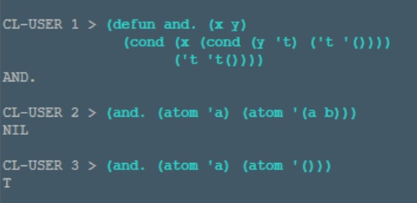
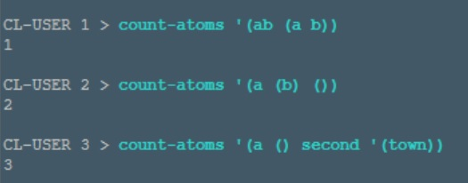

# ,\ L ,\ I ,\ S ,\ P ,\

LISP is a functional programming language developed by John McCarthy in 1958, who explained its design with a paper in Communications of the ACM[1] later.

It was inspired by the lambda calculus (__λ-calculus__)[2], a formal system composed of rules that define expressions (λ-expressions) evaluated on variables as arguments. 

Similarly, Lisp functions perform on symbolic expressions (S-expressions)[3], tree-structured data written as nested lists that define atoms or expressions (_x_ . _y_).

An example of AND function[4]:

## How it goes...

================

_~ Results of a function that counts the number of atoms in an expression_[5]: [code]()

 

[//]: # "References"
[1]: https://aiplaybook.a16z.com/reference-material/mccarthy-1960.pdf	"McCarthy, J. (1960). Recursive Functions of Symbolic Expressions."
[2]: https://www.ias.ac.in/article/fulltext/reso/019/03/0208-0221	"Karnick, H. (2014). Lisp."
[3]: https://en.wikipedia.org/wiki/S-expression
[4]: http://www.paulgraham.com/rootsoflisp.html	"Graham, P. (2001). The roots of Lisp"
[5]: https://github.com/norvig/paip-lisp/blob/master/docs/chapter1.md	"Ex. 1.3 - Paradigms of Artificial Intelligence Programming"

[//]: # "__'**',\,'**'.L.'**',\,'**'.I.'**',\,'**'.S.'**',\,'**'.P.'**',\,'**'__"
